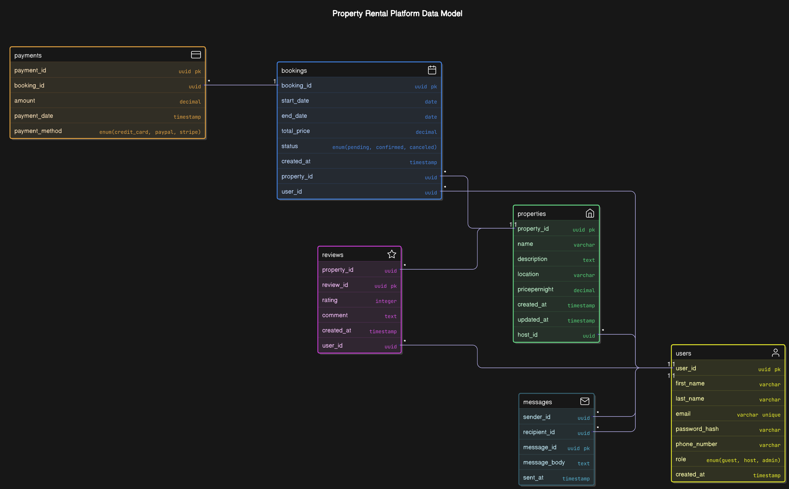

# Airbnb Database Schema Documentation 🚀

> Welcome aboard! This guide breaks down our Airbnb-style schema in **clear, cool markdown**, covering everything from entities and attributes to relationships, normalization, and key concepts we’ve discussed.

---

## 📦 1. Entities & Attributes

Each entity is a "table" in our database, holding specific information.

| **Entity**   | **Primary Key**     | **Attributes**                                                                                                   |
|--------------|---------------------|------------------------------------------------------------------------------------------------------------------|
| **User**     | `user_id` (UUID)    | `first_name`, `last_name`, `email` (unique), `password_hash`, `phone_number`, `role` (ENUM), `created_at`       |
| **Property** | `property_id` (UUID)| `host_id` (FK → User), `name`, `description`, `street_address`, `city`, `state`, `country`, `price_per_night`, `created_at`, `updated_at` |
| **Booking**  | `booking_id` (UUID) | `property_id` (FK → Property), `user_id` (FK → User), `start_date`, `end_date`, `status` (ENUM), `created_at`    |
| **Payment**  | `payment_id` (UUID) | `booking_id` (FK → Booking), `amount`, `payment_date`, `payment_method` (ENUM)                                   |
| **Review**   | `review_id` (UUID)  | `property_id` (FK → Property), `user_id` (FK → User), `rating` (1–5), `comment`, `created_at`                    |
| **Message**  | `message_id` (UUID) | `sender_id` (FK → User), `recipient_id` (FK → User), `message_body`, `sent_at`                                   |

#### 📌 Notes on ENUMs
- **Role**: `{guest, host, admin}`
- **Status**: `{pending, confirmed, canceled}`
- **Payment Method**: `{credit_card, paypal, stripe}`

> **Tip**: ENUM columns are _non-key_—they describe a record but don’t identify it uniquely. 👍

---

## 🌐 2. Relationships

  

1. **User ↔ Property**  
   - **1 host** (User) can list **many properties**.  
   - `Property.host_id` → `User.user_id`

2. **Property ↔ Booking**  
   - **1 property** can have **many bookings**.  
   - `Booking.property_id` → `Property.property_id`

3. **User ↔ Booking**  
   - **1 guest** (User) can make **many bookings**.  
   - `Booking.user_id` → `User.user_id`

4. **Booking ↔ Payment**  
   - **1 booking** can have **many payments** (e.g., deposit + final).  
   - `Payment.booking_id` → `Booking.booking_id`

5. **Property ↔ Review**  
   - **1 property** receives **many reviews**.  
   - `Review.property_id` → `Property.property_id`

6. **User ↔ Review**  
   - **1 user** can write **many reviews**.  
   - `Review.user_id` → `User.user_id`

7. **User ↔ Message**  
   - **1 user** can send/receive **many messages**.  
   - `Message.sender_id` & `Message.recipient_id` → `User.user_id`

---

## 🧹 3. Normalization Walkthrough

We normalize to avoid data duplication and anomalies.

### 1NF (First Normal Form)
- **Atomic values**: Split `location` into `street_address`, `city`, `state`, `country`.  
- **Unique PK**: Every table has a single UUID.

### 2NF (Second Normal Form)
- **No partials**: Composite keys (if any) have no attributes depending on only _part_ of the key.

**Partial Dependency Example**:  
> In `(StudentID, CourseID) → StudentName`, `StudentName` depends on `StudentID` alone. Move `StudentName` to a `Student` table.

### 3NF (Third Normal Form)
- **No transitive**: Non-key attrs don’t depend on other non-key attrs.

**Transitive Dependency Example**:  
> `UserID → DepartmentID → DepartmentName` implies `DepartmentName` is transitively dependent on `UserID`. Solution: separate `Department` table.

We also removed `total_price` (it’s derived: nights × price) and moved ENUM sets into lookup tables if desired.

---

## 🔑 4. Key vs. Non-Key Columns

- **Key Column**: Uniquely identifies a record (e.g., `user_id`).  
- **Non-Key Column**: Holds descriptive data (e.g., `email`, `role`, or any ENUM). These do _not_ help locate a row on their own.

---

## 🎉 5. Summary

- **Entities**: User, Property, Booking, Payment, Review, Message.  
- **Attributes**: Clear PKs, FKs, ENUMs, timestamps.  
- **Relationships**: One-to-many chains link users, listings, bookings, and more.  
- **Normalization**: We achieved 3NF—no partial/transitive dependencies, atomic data, derived fields computed on the fly.

_With this structure, our Airbnb-like system stays tidy, flexible, and performant—no more repeating Grandma’s phone number on every pancake recipe!_ 🚀
